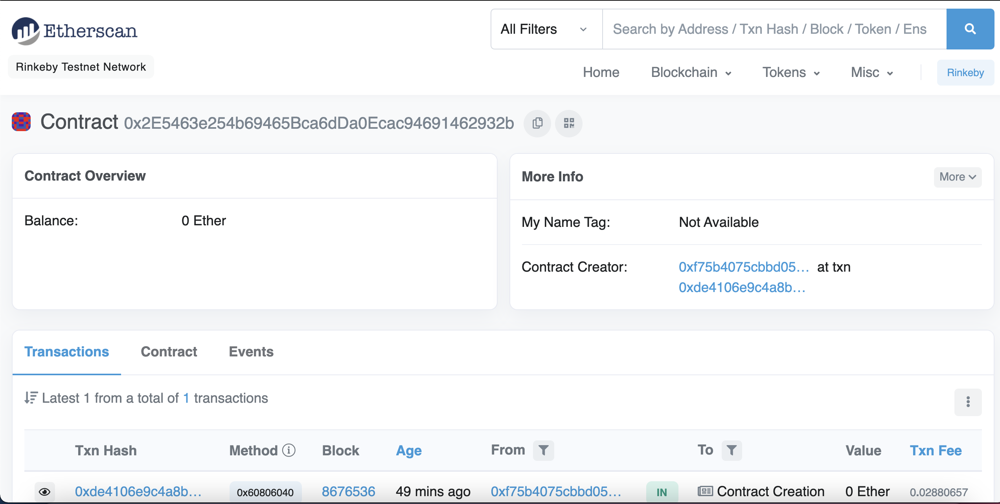
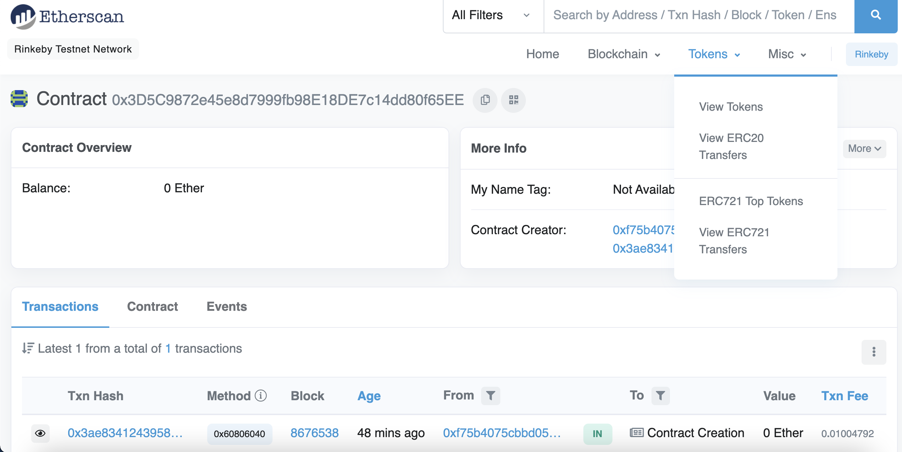
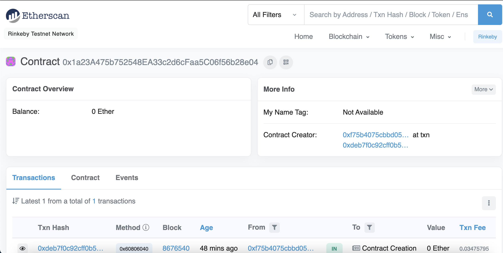
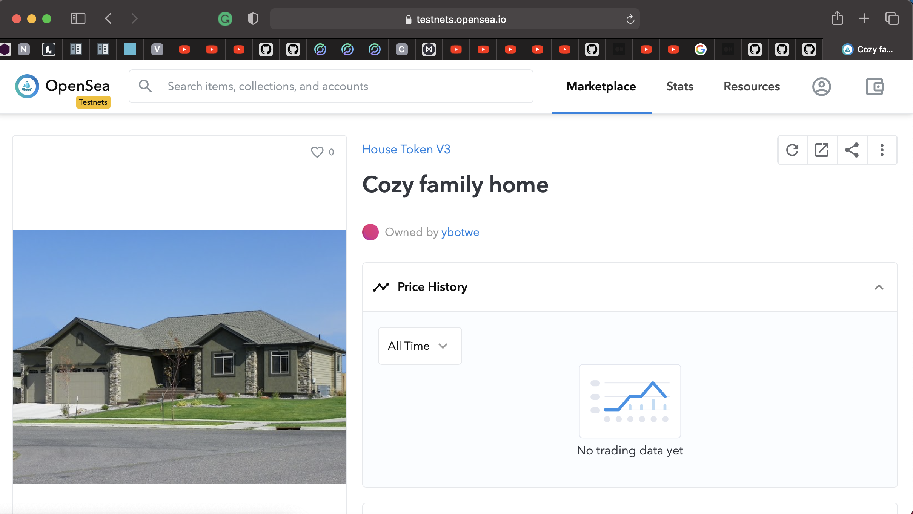

# Blockchain-Capstone

Capstone project of Udacity Blockchain Developer Nanodegree to build a decentralized housing service.

### Info of project

* Truffle v5.0.20 (core: 5.0.20)
* Solidity v0.5.0 (solc-js)
* Node v10.16.0
* Web3.js v1.0.0-beta.37

### Install dependencies

```
$ npm install
```

## Compile 

```
$ truffle compile
```

## Test

```
$ truffle Test
```

## Deploy Contract to Rinkeby:

```
$ truffle migrate --reset --network rinkeby
```

### ERC721Mintable Smart contract

Contract Address: 0x2E5463e254b69465Bca6dDa0Ecac94691462932b



### Verifier Smart contract

Contract Address: 0x3D5C9872e45e8d7999fb98E18DE7c14dd80f65EE



### SolnSquareVerifier Smart contract

Contract Address: 0x1a23A475b752548EA33c2d6cFaa5C06f56b28e04



### OpenSea marketplace

https://rinkeby.opensea.io/assets/0x2E5463e254b69465Bca6dDa0Ecac94691462932b/1




https://rinkeby.opensea.io/accounts/0xf75b4075cbbd0540e4739eed90ae8cabf2775ef8


### Token Storefront marketplace

https://rinkeby.opensea.io/collection/house-token-v3-1


## Built With

* [Ethereum](https://www.ethereum.org/) - Ethereum is a decentralized platform that runs smart contracts
* [IPFS](https://ipfs.io/) - IPFS is the Distributed Web | A peer-to-peer hypermedia protocol
to make the web faster, safer, and more open.
* [Truffle Framework](http://truffleframework.com/) - Truffle is the most popular development framework for Ethereum with a mission to make your life a whole lot easier.

## Authors

* **Yaw Botwe** - *Blockhain engineer* - [github profile](https://github.com/ybotwe)

## License

This project is licensed under the MIT License

# Project Resources

* [Remix - Solidity IDE](https://remix.ethereum.org/)
* [Visual Studio Code](https://code.visualstudio.com/)
* [Truffle Framework](https://truffleframework.com/)
* [Ganache - One Click Blockchain](https://truffleframework.com/ganache)
* [Open Zeppelin ](https://openzeppelin.org/)
* [Interactive zero knowledge 3-colorability demonstration](http://web.mit.edu/~ezyang/Public/graph/svg.html)
* [Docker](https://docs.docker.com/install/)
* [ZoKrates](https://github.com/Zokrates/ZoKrates)
